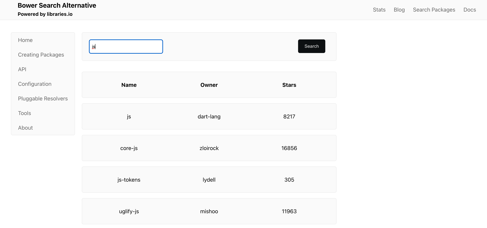

## Task - Replicate Bower.io | Frontend-Exercise

### Coding challenge

Please write a responsive website, which mimics the behaviour of
https://bower.io/search/. The application should be programmed using
TypeScript and React.

**Layout**

The site should have a header section, a left sidebar, a footer and a
content area. The content area should show a list of modules with their
name, owner & stars.
You can implement your own design or copy the style from the original
Bower page. You can also use the UI library of your choice or implement
your own React components. As you prefer. Placeholders can be used for
the content.

**Pagination & Sorting**

The list of modules should be [sortable by
stars](https://libraries.io/api#project-search). It is important that the
list is paged, which means that only 5 items per page will be shown. It
should also be possible to search for a specific module.

**API**

You can use the Libraries.io API to query for modules (Example:
https://libraries.io/api/bower-search?q=jquery). It will return you all
the data which you need to display.

**Assessment**

When writing your code, please make sure that your project is structured
and can be executed with `yarn install` & `yarn start`.
When running `yarn start`, a browser should show up and display your
developed site. If we run `yarn test`, we want to see unit tests running
for the business logic of your code. Your project must be cross-platform
compatible (running on Linux, Windows & macOS).

[Alvaro Hernandez](mailto:alvarohernandezassens@gmail.com)

## Proposed Solution

- Setup client with create-react-app
- Create basic component structure and design state workflow
- Setup Jest and add tests
- Implement state system with props
- Implement styes with styled-components
- Refine logic and fix bugs

### [Click here to see the Live Demo](https://replica.vercel.app/)

## Screenshots

## Assumptions

-

## Libraries / Tools Used

- React.js
- Create React App for project setup
- Typescript
- Styled Components
- React Icons
- Jest

## Frontend Setup

To install the dependencies run in the client folder:

`npm install`

And to run the app, also in the client folder:

`npm start`

## Running the tests

You can run the unit tests using:

`npm test`

## Future Work

1. Complete unit testing with Jest and react-testing-library until coverage of at least 90%.
2. Replace react-icons with plain SVGs for better performance.
3. Replace styled-components with plain CSS for better caching.
4. Implement Lazy Loading.
